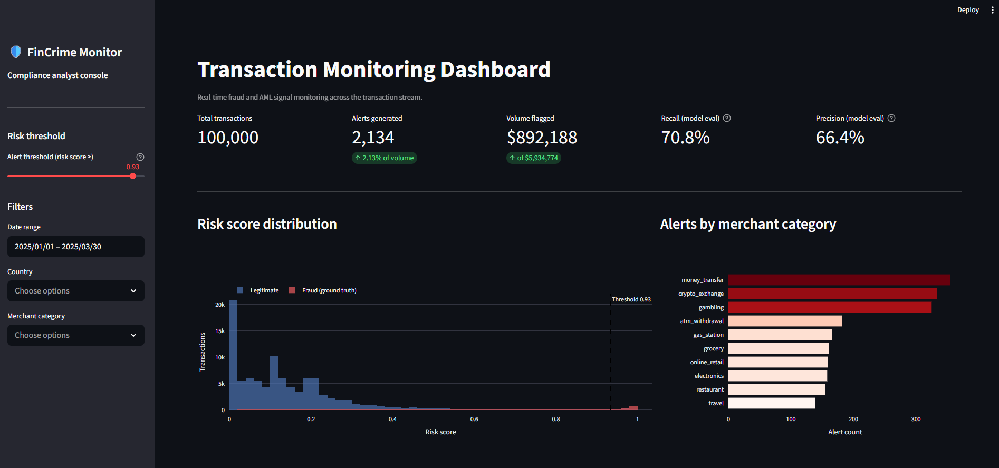
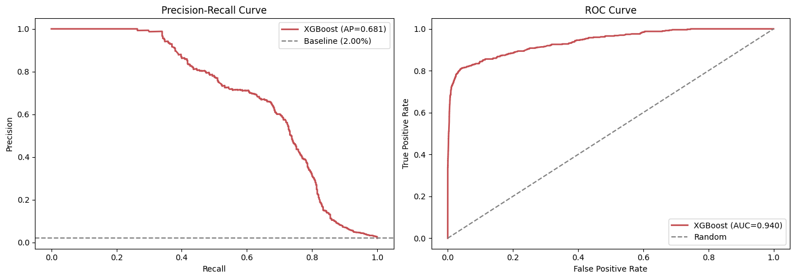
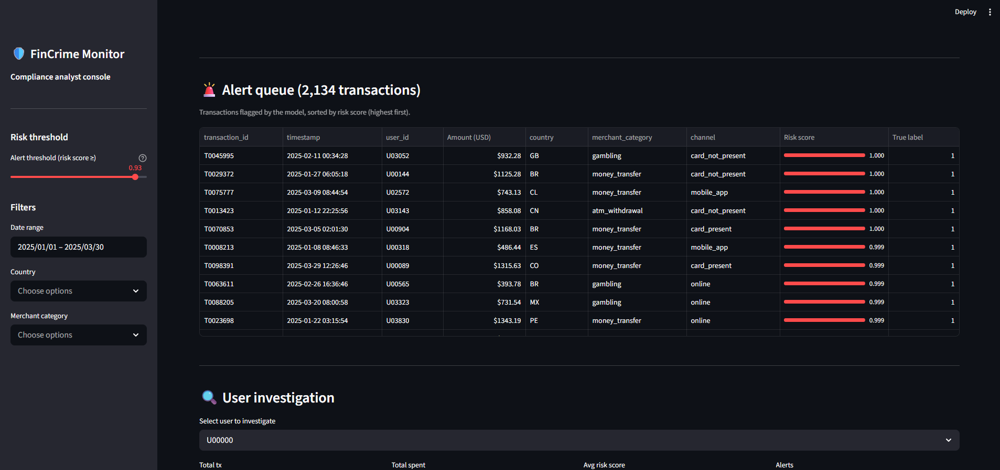
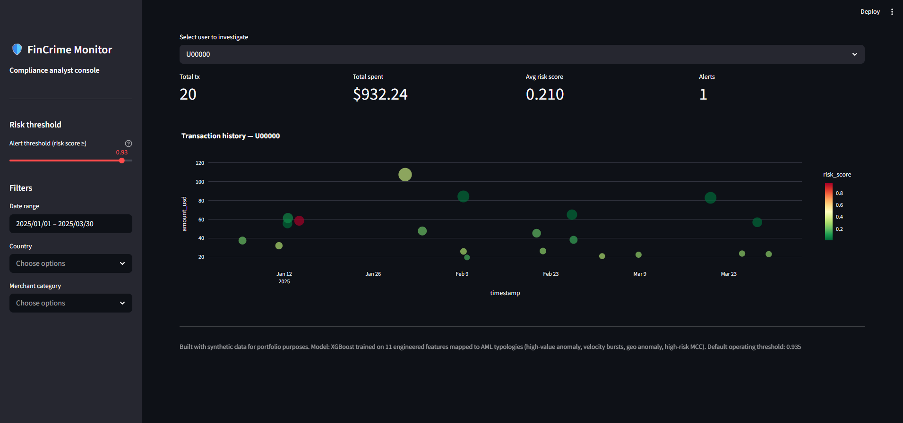

# 🛡️ FinCrime Transaction Monitor
🔴 **[Live Demo](https://fincrime-monitor.streamlit.app)**

End-to-end fraud detection system simulating a transaction monitoring pipeline used by neobanks and fintechs for AML compliance. Built as a portfolio project to demonstrate applied machine learning, feature engineering aligned with real fraud typologies, and an operational dashboard for compliance analysts.



---

## 📋 Project overview

This project simulates the core of a financial crime monitoring system: ingesting transactions, scoring them in real time against a fraud detection model, and surfacing high-risk activity in an operational dashboard. The technical stack mirrors what fintechs like Revolut, Nubank, and similar neobanks use internally for transaction monitoring.

**Key components:**
- Synthetic transaction data generator with realistic fraud typologies
- Feature engineering pipeline mapped to AML typologies
- XGBoost classifier with Logistic Regression baseline
- Interactive Streamlit dashboard for compliance analysts

---

## 🎯 Business problem

Financial institutions process millions of transactions daily. A small fraction (~1-3%) is fraudulent, but the cost is high: direct financial loss, regulatory penalties, and reputational damage. Manual review of every transaction is impossible, and naive rule-based systems generate too many false positives, overwhelming compliance teams.

This project solves that with a two-tier approach: a machine learning model that scores every transaction in milliseconds, and a dashboard that lets analysts focus their attention on the highest-risk cases.

---

## 🏗️ Architecture

```
Raw transactions ──► Feature engineering ──► XGBoost scoring ──► Dashboard
                          (11 features)        (PR-AUC 0.68)      (Streamlit)
```

**Project structure:**
```
fincrime-transaction-monitor/
├── data/                          # Generated datasets (gitignored)
├── notebooks/
│   ├── 02_eda.ipynb              # Exploratory analysis
│   ├── 03_features.ipynb         # Feature validation
│   └── 04_modeling.ipynb         # Model evaluation
├── src/
│   ├── data_generator.py         # Synthetic transaction generator
│   ├── feature_engineering.py    # 11 risk features
│   └── modeling.py               # Training pipeline
├── dashboard/
│   └── app.py                    # Streamlit operational dashboard
├── models/                       # Trained model artifacts
├── images/                       # Dashboard screenshots
├── requirements.txt
└── README.md
```

---

## 🔬 Technical approach

### 1. Synthetic data generation

Generated 100,000 transactions across 5,000 users over 90 days, with **2% fraud prevalence** to match real-world card fraud rates (industry benchmark: 1-3%). Fraud is not random — it follows four injected typologies aligned with real AML/fraud patterns:

| Typology | Description |
|---|---|
| **High-value anomaly** | Transactions 10–50× the user's baseline amount |
| **Geo anomaly** | Card-not-present transactions from high-risk jurisdictions |
| **High-risk MCC** | Activity in gambling, crypto exchange, and money transfer categories |
| **Velocity burst** | Card-testing pattern: many small transactions in a short window |

Amounts follow a log-normal distribution (matching real transaction data), and users have distinct behavioral baselines that enable user-level feature engineering.

### 2. Feature engineering

Eleven features mapped to fraud typologies. All rolling features use `closed='left'` or `shift(1)` to prevent data leakage:

| Family | Features | Typology captured |
|---|---|---|
| **Amount** | `amount_vs_user_avg`, `amount_zscore`, `log_amount` | High-value anomaly |
| **Velocity** | `tx_count_1h`, `tx_count_24h`, `amount_sum_24h` | Card testing, account takeover |
| **Geographic** | `is_foreign_country`, `is_high_risk_country` | Geo anomaly, FATF jurisdictions |
| **Behavioral** | `is_high_risk_mcc`, `is_night_tx`, `is_cnp` | Layering, structuring, CNP fraud |

### 3. Modeling

Two models trained and compared:

| Model | PR-AUC | ROC-AUC | Precision @ optimal threshold | Recall @ optimal threshold | F1 |
|---|---|---|---|---|---|
| Logistic Regression (baseline) | 0.58 | — | — | — | — |
| **XGBoost (production)** | **0.68** | **0.94** | **65.7%** | **67.4%** | **0.67** |

**Why these metrics:** With 2% fraud prevalence, accuracy is misleading (a model predicting "always legitimate" scores 98%). PR-AUC focuses on the minority class, which is what matters for fraud detection.

**Why XGBoost:** Tabular data with mixed feature types and non-linear interactions — XGBoost consistently outperforms deep learning on this kind of structured data, with full interpretability via feature importance and SHAP.

**Threshold selection:** The default operating threshold (0.934) maximizes F1 on the held-out test set. In production, this would be a business decision balancing the cost of false negatives (missed fraud, regulatory exposure) against false positives (customer friction).



### 4. Operational dashboard

Built with Streamlit and Plotly. Designed for the workflow of a compliance analyst reviewing alerts:



**Features:**
- Adjustable risk threshold (sidebar slider) — analyst can balance recall vs precision in real time
- Live KPI updates: alert volume, flagged amount, model recall and precision
- Risk score distribution showing class separation
- Filterable alert queue sorted by risk score
- Per-user investigation view with transaction history



---

## 🚀 How to run

### Prerequisites
- Python 3.10+
- ~500 MB free disk space

### Setup

```bash
git clone https://github.com/Rivalry11/fincrime-transaction-monitor.git
cd fincrime-transaction-monitor

python -m venv venv
source venv/bin/activate          # Windows: venv\Scripts\activate
pip install -r requirements.txt
```

### Run the pipeline

```bash
# 1. Generate synthetic data
python src/data_generator.py

# 2. Build features
python src/feature_engineering.py

# 3. Train models
python src/modeling.py

# 4. Launch dashboard
streamlit run dashboard/app.py
```

The dashboard opens at `http://localhost:8501`.

---

## 🛠️ Tech stack

- **Python 3.10+**
- **Data:** pandas, numpy, Faker
- **ML:** scikit-learn, XGBoost
- **Dashboard:** Streamlit, Plotly
- **Notebooks:** Jupyter, matplotlib, seaborn

---

## 🔮 Roadmap

This MVP demonstrates the core pipeline. Production-grade extensions on the roadmap:

- [ ] Airflow DAG for scheduled retraining and batch scoring
- [ ] BigQuery integration for transaction storage and feature serving
- [ ] Real-time scoring API (FastAPI) with sub-100ms latency
- [ ] Model drift monitoring and automated alerts
- [ ] SHAP-based per-prediction explanations for analyst review
- [ ] Network analysis features (graph-based connections between users)

---

## 📚 Notes on AML domain

Features and typologies in this project draw from publicly documented patterns in financial crime compliance:

- **FATF** (Financial Action Task Force) high-risk jurisdiction lists
- **AML typologies**: placement, layering, integration
- **Card fraud patterns**: card testing, account takeover, CNP fraud
- **Risk indicators**: high-risk MCCs (gambling, crypto, money transfer), velocity anomalies, geographic deviations

This is a **synthetic, educational project** — not connected to any real financial system or production data.

---

## 👤 Author

**Camila Rubio Cuellar**
Data Analyst transitioning to Financial Crime Analytics
[LinkedIn](https://www.linkedin.com/in/camila-rubio-cuellar/) · [GitHub](https://github.com/Rivalry11)

---

*Built April 2026 as part of an active job search portfolio.*
